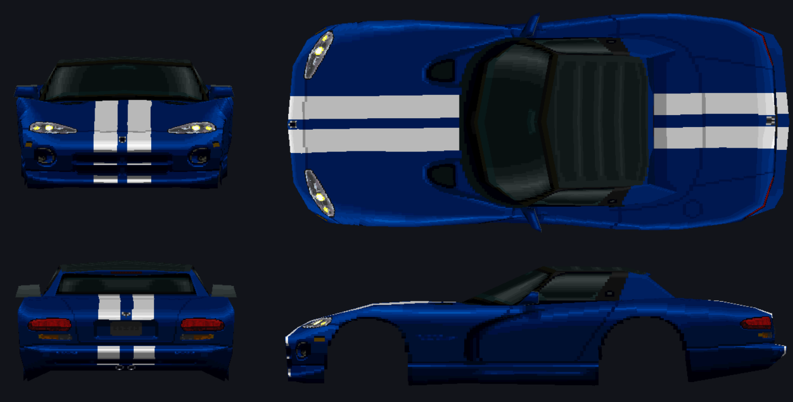
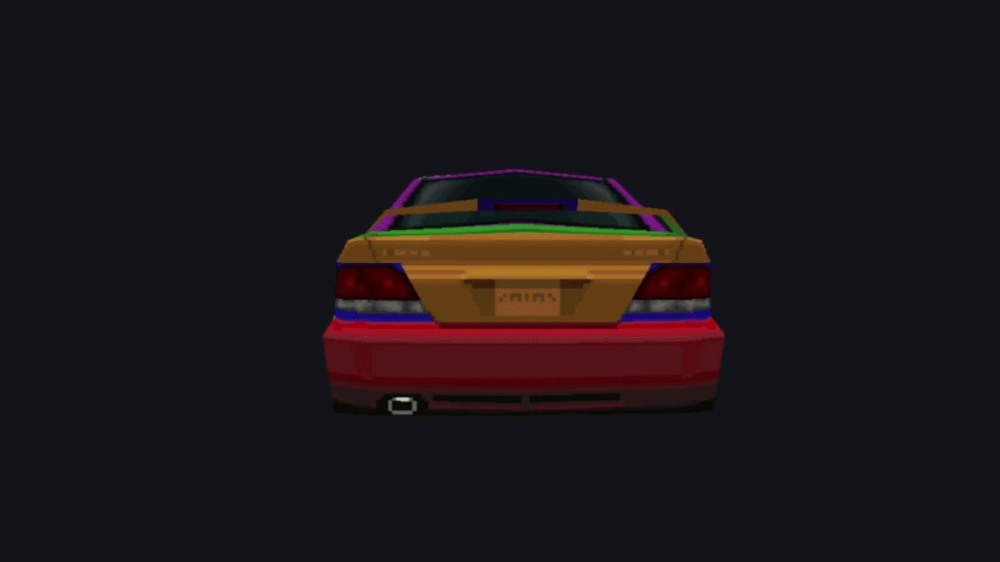

  

  <h1>GTExplorer</h1>

  
<b>An all-in-one extractor, viewer, editor, and repacker for Gran Turismo 1 (PS1) archive files.</b>

  
  
  
  
  
  
  

---

  
  

---

## Features

- **Archive Management** — Extract and repack **GT-ARC** / **GT-ZIP** archives (`.DAT` / `.ARC`). Uses `manifest.txt` when present.
- **Asset Viewer** — View TIM, TIM packs (`.tpk`), CTEX, GT-PS, and other GT assets.
- **3D Model Viewer** — Preview 3D car and track models.
- **Built-in Editors** — Edit save data, view car databases, adjust color palettes, and run debug tools.
- **Preview Options** — Inspect text files, GTHTML, SPEC / COLOR tables, and sound sequences.
- **TIM Tools** — Convert, re-encode, replace, swap palettes, and batch-process TIM textures (requires Pillow).
- **Region Support** — Built-in regional file lists for accurate asset identification.
- **TIM & Expansion Tools** — Optional TIM packing and INST/ENGN sample expansion.
- **Disc Rebuilding Pipeline** — Integrated wrapper for [mkpsxiso](https://github.com/Lameguy64/mkpsxiso) (`dumpsxiso` / `mkpsxiso`) directly within the GUI.
- **In-App Help** — Built-in user guide (Help button or **Help → User Guide**).

> 💡 **Tip:** Always perform a clean **Extract All** (with `manifest.txt`) prior to modifying assets for seamless repacking.

---

## Work in Progress

### Palette Editor
 In latest build

### Database Editor

---

## Known Limitations

- **TIM Pack Repacking:** Repacking `.tpk` files is not yet implemented. Loose `.TIM` files can be edited normally.
- **Model Renderer:** Model viewing is experimental. Models currently lack wheels (using placeholders for now) and may cause performance slowdowns or crashes.
- **Repack Workflow:** You must open the folder you wish to repack via **File → Open Folder** before running a repack operation (**Extract/Repack**).
- **Disc Rebuilding:** Automatic disc rebuilding with `mkpsxiso` can occasionally fail after repacking. Moving modified files into the disc folder manually is recommended.

---

## Setup / Workspace

Open **File → Setup / Workspace…** to configure paths:

| Section | Purpose |
| :--- | :--- |
| **1. Working folders** | **Input** = original `.DAT` / `.ARC` files (read-only). **Output** = extracts and repacked output. |
| **2. Disc dump & rebuild** | *(Optional)* Paths for disc image, `dumpsxiso` XML, disc file tree, and built `.bin`/`.cue`. |

### Suggested Layout

C:\GT1_Modding\
├── GAMEFILES\        ← Original game archives (.DAT / .ARC)
├── _mods\            ← Extracted assets & repacked edits
├── disc_files\       ← ISO files dumped via dumpsxiso
├── gt1.xml           ← Project configuration XML
└── _built\           ← Output directory for rebuilt .bin / .cue

For a simple single-root setup, point the default project paths at something like `C:/GT1/`.

---

## Typical Modding Workflow

 [Dump ISO] ──► [Extract DAT/ARC] ──► [Edit Assets/TIMs] ──► [Repack Archive] ──► [Rebuild ISO]

1. **Dump Game Disc** *(Optional, once)* — Run **Tools → Dump disc (dumpsxiso)…** or set up via Setup.
2. **Extract Archives** — Open a target `.DAT` file and click **Extract → Extract All**.
3. **Modify Assets** — Edit texture files (`.TIM`), text, or other assets in your output directory.
4. **Repack** — Run **Extract → Repack** to generate an updated archive file.
5. **Rebuild Disc** — Copy the modded `.DAT` into the disc file tree (matching the original path), then run **Tools → Build disc (mkpsxiso)…** and boot the new `.cue` in an emulator.

---

## [Supported File Formats](doc/formats.md)

### [Archive Kinds](doc/archives.md)

| Kind | Detection | Examples |
| :--- | :--- | :--- |
| **Standard GT-ARC** | `@(#)GT-ARC` | `COURSE.DAT`, `CAR.DAT`, `SOUND.DAT`, `MENU_RAW.ARC` |
| **Compressed GT-ARC** | Mangled `@(#)GT-A` / `RC` | `CARINF.DAT` |
| **Raw GT-ZIP** | No ARC wrapper | `GAMEFONT.DAT` |

### [Detected File Types](doc/filelists/index.md)

| Content | Extension | Notes |
| :--- | :--- | :--- |
| TIM texture | `.tim` | Preview, replace, re-encode |
| TIM pack | `.tpk` | Expand / rebuild with Extract TIMs |
| GT-PS / GT-CAR / GT-CTEX / GT-SKY | `.ps` / `.car` / `.tex` / `.sky` | Models & textures |
| Nested GT-ARC | `.arc` | Open Nested ARC |
| GTHTML | `.gthtml` | Menu / script data |
| INST / ENGN / SEQG | `.ins` / `.es` / `.seq` | Sound & sequences |
| SPEC, COLOR, TIRE, … | matching | Car part tables |
| Filename lists / text | `.idx` / `.txt` | Name tables & messages |

---

## Requirements & Quick Start

### Prerequisites
- **Python 3.8+**
- **PyQt6** ≥ 6.4
- **Pillow** & **NumPy**

### Installation

git clone https://github.com/JeevesGB/GTExplorer.git
cd GTExplorer
pip install -r requirements.txt

### Running GTExplorer

**Windows**
run.bat

**From terminal**
python src/main.py

1. On first launch, complete **Setup** (input / output folders).
2. **File → Open .DAT** — or click an archive in the Input list.
3. *(Optional)* Pick a region **Names** list in the toolbar.
4. **Extract → Extract All** into your output folder.
5. Edit files on disk, then **Extract → Repack**.

Press <kbd>F1</kbd> or click **Help** in the toolbar for the full User Guide.

##### [Usage](doc/usage.md)

---

## Tools Folder

GTExplorer does **not** ship `mkpsxiso`. To dump or rebuild full disc images:

1. Download the official release: [Lameguy64/mkpsxiso](https://github.com/Lameguy64/mkpsxiso/releases/latest)
2. Place `mkpsxiso.exe` and `dumpsxiso.exe` in the project's `tools/` directory.

tools/
├── README.txt          ← Ships with the project
├── mkpsxiso.exe        ← You add (official release)
└── dumpsxiso.exe       ← You add

---

## Keyboard Shortcuts

| Shortcut | Action |
| :--- | :--- |
| <kbd>Ctrl</kbd> + <kbd>O</kbd> | Open archive |
| <kbd>Ctrl</kbd> + <kbd>Shift</kbd> + <kbd>O</kbd> | Open extract folder |
| <kbd>Ctrl</kbd> + <kbd>E</kbd> | Extract selected |
| <kbd>Ctrl</kbd> + <kbd>F</kbd> | Focus filter |
| <kbd>F1</kbd> | Open User Guide |

---

## Credits

- [pez2k / gt2tools](https://github.com/pez2k/gt2tools) — prior research into GT1 files
- [Lameguy64 / mkpsxiso](https://github.com/Lameguy64/mkpsxiso) — optional disc dump & rebuild

---

## License

Distributed under the [MIT License](LICENSE).