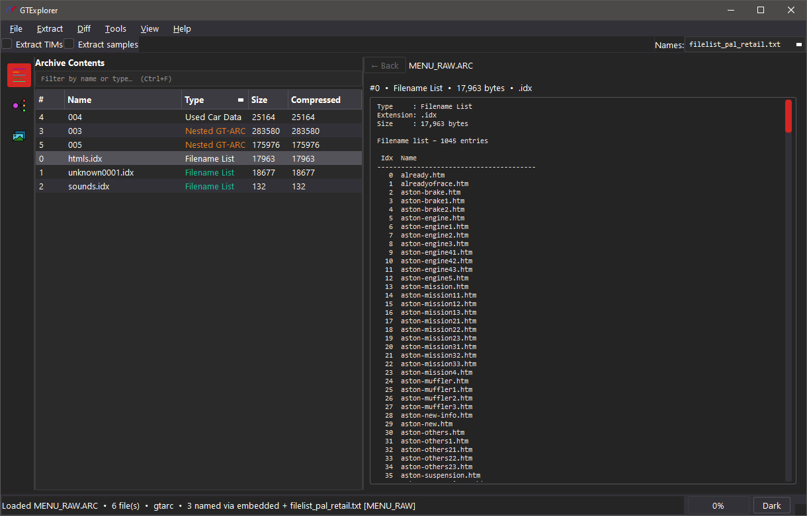
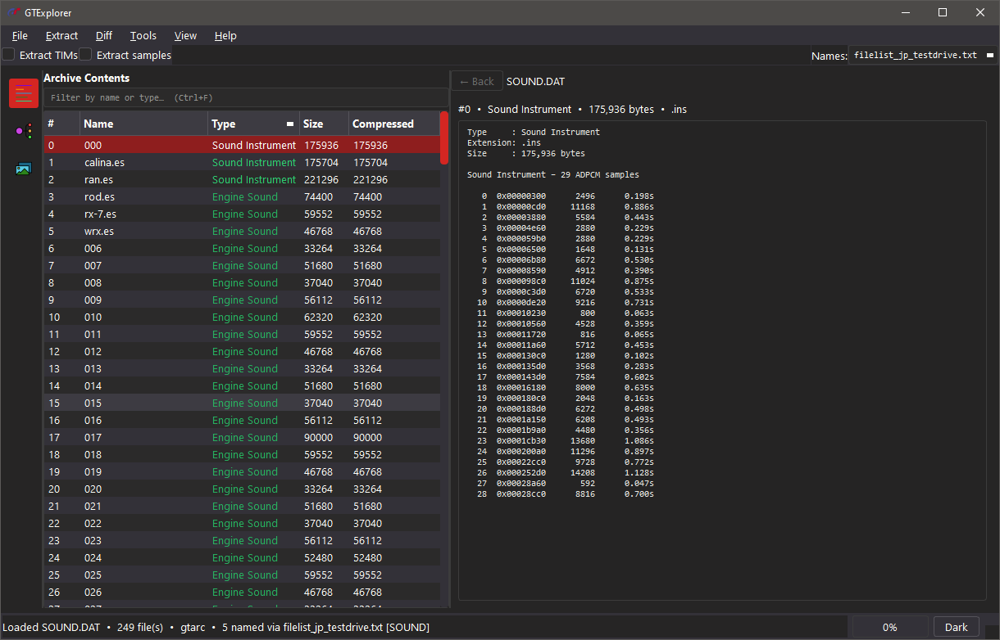
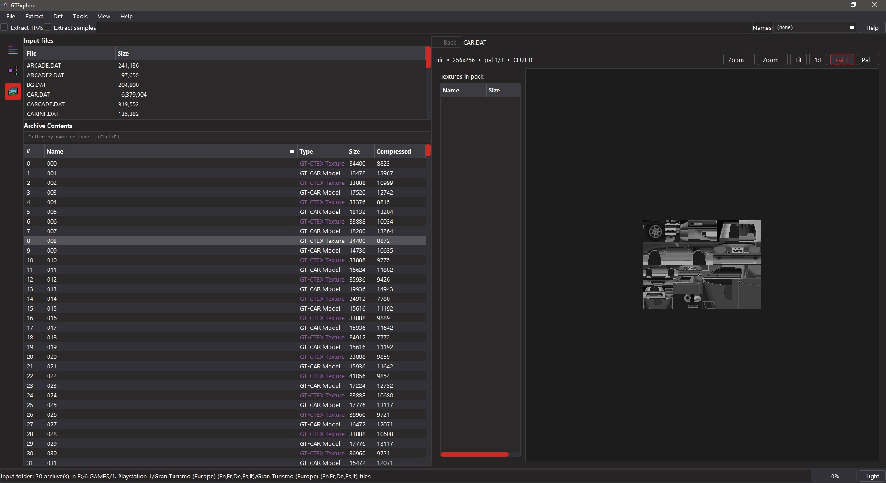
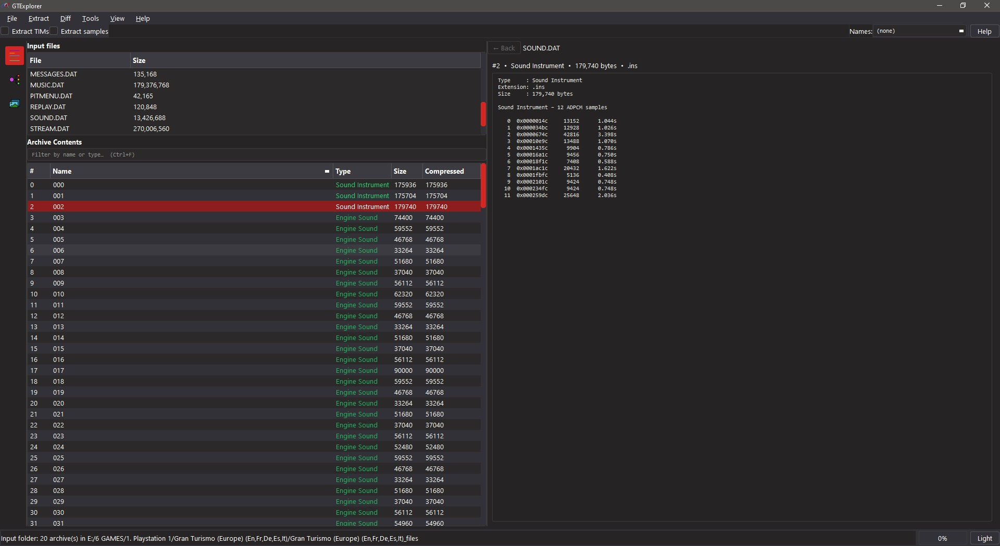
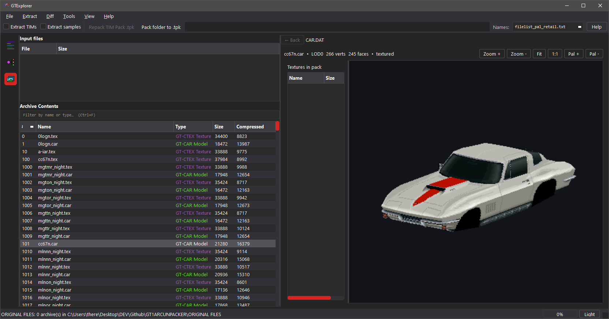

<div align="center">
  
</div>

[](LICENSE)
[](https://www.python.org/)
[](https://www.riverbankcomputing.com/software/pyqt/)

[]()
[](https://github.com/JeevesGB/GTExplorer/commits/main)
[](https://github.com/JeevesGB/GTExplorer/releases)

**GTExplorer** is an extractor, viewer, and repacker for **Gran Turismo 1** (PlayStation) archive files, with optional full disc dump/rebuild via [mkpsxiso](https://github.com/Lameguy64/mkpsxiso).

<div align="center">
  
  
  
  
  
  
  
</div>

---

## Features

- Extract **GT-ARC** / **GT-ZIP** archives
- **Repack** extracted folders back to `.DAT` / `.ARC` (uses `manifest.txt` when present)
- Optional **TIM pack** expansion and rebuild
- Optional **INST / ENGN** sample expansion
- Region **file lists** for real asset names on extract
- Built-in **Asset Viewer** (TIM, TIM packs, GT-CTEX, GT-PS)
- **Preview** for sequences, filename lists, GTHTML, and car part tables (SPEC, COLOR, …)
- **TIM tools** — convert / re-encode / replace / batch convert (requires Pillow)
- **Setup / Workspace** — project paths for originals, mods, and disc tools
- **Disc dump & rebuild** (optional) — run `dumpsxiso` / `mkpsxiso` from the GUI
- In-app **User Guide** (Help button or **Help → User Guide**)

> 💡 Prefer a clean **Extract All** (with `manifest.txt`) before editing and repacking.

---

## Requirements

- **Python 3.8+**
- **PyQt6** ≥ 6.4
- [Pillow](https://python-pillow.org/) — needed for the Asset Viewer and TIM tools

```bash
pip install -r requirements.txt
```

### Optional: disc rebuild

GTExplorer does **not** ship `mkpsxiso`. To dump or build full disc images:

1. Download the official release: [Lameguy64/mkpsxiso](https://github.com/Lameguy64/mkpsxiso/releases/latest)
2. Place `mkpsxiso.exe` and `dumpsxiso.exe` in the project's `tools/` folder (see `tools/README.txt`)
3. Configure the paths under **File → Setup / Workspace…**

---

## Quick start

**Windows**
```bat
runtool.bat
```

**From the repo root**
```bash
python src/main.py
```

1. On first launch, complete **Setup** (input / output folders).
2. **File → Open .DAT** — or click an archive in the Input list.
3. *(Optional)* pick a region **Names** list in the toolbar.
4. **Extract → Extract All** into your output folder.
5. Edit files on disk, then **Extract → Repack**.

Press the toolbar **Help** button for the full User Guide.

---

## Setup / Workspace

Open via **File → Setup / Workspace…**

| Section | Purpose |
|---|---|
| **1. Working folders** | **Input** = original `.DAT` / `.ARC` files (read-only). **Output** = extracts and packs. |
| **2. Disc dump & rebuild** | *(Optional)* Paths for the disc image, dumpsxiso XML, disc file tree, and built `.bin`/`.cue`. |

Suggested layout:
```
C:\GT1\
  GAMEFILES\       ← input (original archives or dumped disc files)
  _mods\           ← output (extracts / intermediate packs)
  disc_files\      ← dumpsxiso extract (full disc tree)
  gt1.xml          ← dumpsxiso project XML
  _built\          ← mkpsxiso output .bin / .cue
```

For a simple single-root setup, point the default project paths at something like **`C:/GT1/`**.

---

## Typical mod loop

1. **Dump the disc** *(optional, once)* — **Tools → Dump disc (dumpsxiso)…** or from Setup.
2. Open a `.DAT` → **Extract All**.
3. Edit TIM / text / other assets in the extract folder.
4. **Repack** the folder into a new `.DAT`.
5. Copy the modded `.DAT` into the disc file tree, using the same path/name as the original.
6. **Tools → Build disc (mkpsxiso)…**, then boot the new `.cue` in an emulator.

---

## Archive kinds

| Kind | Detection | Examples |
|---|---|---|
| Standard GT-ARC | `@(#)GT-ARC` | `COURSE.DAT`, `CAR.DAT`, `SOUND.DAT`, `MENU_RAW.ARC` |
| Compressed GT-ARC | Mangled `@(#)GT-A` / `RC` | `CARINF.DAT` |
| Raw GT-ZIP | No ARC wrapper | `GAMEFONT.DAT` |

---

## Detected file types

| Content | Extension | Notes |
|---|---|---|
| TIM texture | `.tim` | Preview, replace, re-encode |
| TIM pack | `.tpk` | Expand / rebuild with Extract TIMs |
| GT-PS / GT-CAR / GT-CTEX / GT-SKY | `.ps` / `.car` / `.tex` / `.sky` | Models & textures |
| Nested GT-ARC | `.arc` | Open Nested ARC |
| GTHTML | `.gthtml` | Menu / script data |
| INST / ENGN / SEQG | `.ins` / `.es` / `.seq` | Sound & sequences |
| SPEC, COLOR, TIRE, … | matching | Car part tables |
| Filename lists / text | `.idx` / `.txt` | Name tables & messages |

---

## Tools folder

```
tools/
  README.txt          ← ships with the project
  mkpsxiso.exe        ← you add (official release)
  dumpsxiso.exe       ← you add
```

Binaries are gitignored — each user installs the official build themselves.

---

## Keyboard shortcuts

| Shortcut | Action |
|---|---|
| `Ctrl+O` | Open archive |
| `Ctrl+Shift+O` | Open extract folder |
| `Ctrl+E` | Extract selected |
| `Ctrl+F` | Focus filter |

---

## Credits

- [pez2k / gt2tools](https://github.com/pez2k/gt2tools) — prior research into GT1 files
- [Lameguy64 / mkpsxiso](https://github.com/Lameguy64/mkpsxiso) — optional disc dump & rebuild

---

## License

MIT — see [LICENSE](LICENSE).