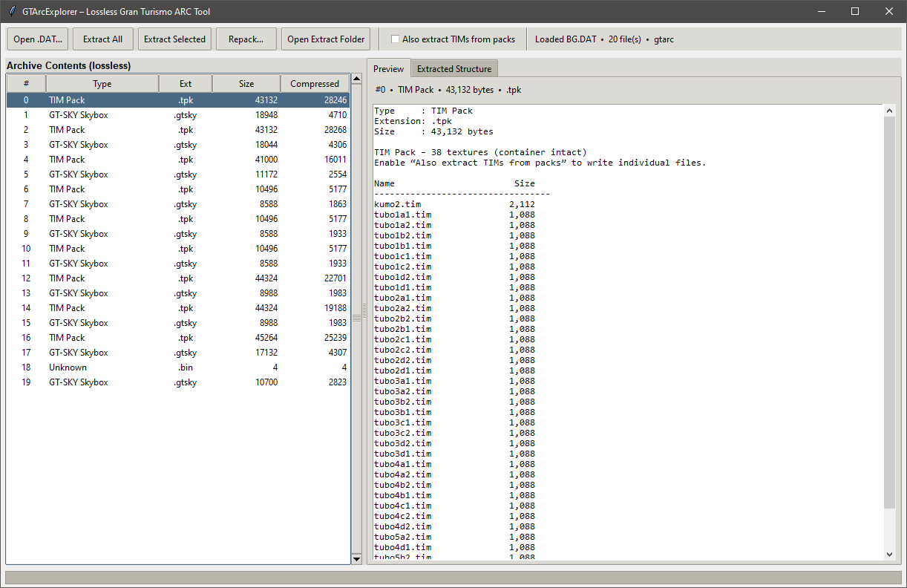
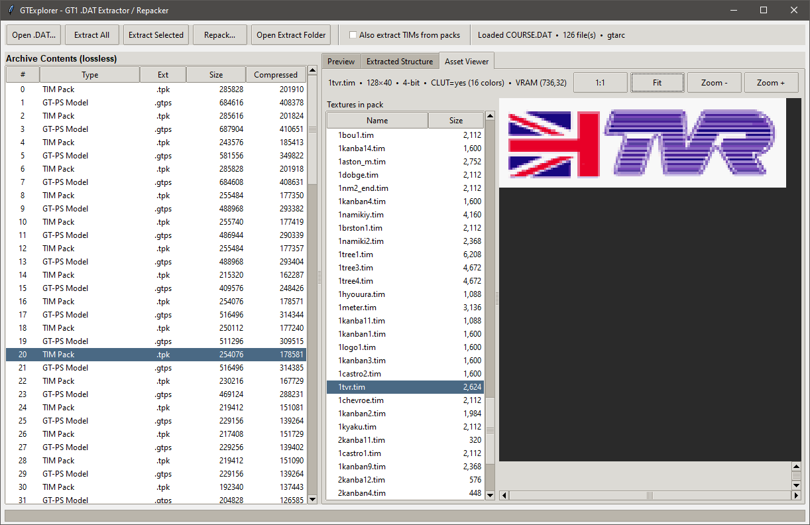

# GTExplorer

Extractor for **Gran Turismo 1** (PlayStation) archive files.

Lossless by default: entries are written **exactly as stored** after GT-ZIP decompression. No format conversion and no header rewriting unless you opt into TIM-pack rebuild on repack.





---

## Features

- Extract **GT-ARC** / **GT-ZIP** archives
- Optional **TIM pack** expansion and rebuild
- Optional **INST / ENGN** sample expansion
- **Region file lists** for real asset names on extract
- Built-in **Asset Viewer** (TIM, TIM packs, GT-CTEX, GT-PS point cloud)
- **Preview** for sequences, filename lists, and car part tables (SPEC, COLOR, …)
- Progress feedback while loading large archives

---

## Requirements

- Python 3.8+
- [Pillow](https://python-pillow.org/) (Asset Viewer)
- PyQt6 6.4

```bash
pip install -r requirements.txt
```

---

## Usage

From the repo root:

```bash
python src/oldmain.py
```

Or on Windows:

```bash
runtool.bat
```

### Open an archive

**Open…** — select a `.DAT` / `.ARC` file.

| Kind | Detection | Examples |
|------|-----------|----------|
| Standard GT-ARC | Header `@(#)GT-ARC` | `COURSE.DAT`, `CAR.DAT`, `SOUND.DAT`, `MENU_RAW.ARC`, … |
| Compressed GT-ARC | Mangled header (`@(#)GT-A` / `RC`) | `CARINF.DAT` |
| Raw GT-ZIP | No ARC wrapper | `GAMEFONT.DAT` |

Large files show a status bar and progress while reading and identifying types.

### File names

Use the **File names** dropdown (or **Browse…**) to load a region list so extracted files use real names instead of `000`, `001`, …

Bundled lists live under `src/gtarcexplorer/filelists/` (PAL / USA / JP retail and demos).

If no external list matches and an archive contains an embedded filename list of the same length as its entry count, those names are applied automatically.

### Extract

- **Extract All** — every entry into a folder  
- **Extract Selected** — only selected rows  

Extensions come from content magic (see below). A `manifest.txt` is written for lossless repacking.

#### Optional: expand TIM packs

Enable **Expand TIM packs** before extracting.

Each `.tpk` is still written intact, plus a subfolder:

```
000.tpk
000_tims/
  refrect.tim
  circuit.tim
  …
```

#### Optional: expand INST / ENGN samples

Enable **Expand INST/ENGN samples** before extracting.

Instrument / engine banks are kept intact; samples can be written out for editing. On repack, edited sample data is folded back into the bank when present.

### Asset Viewer

Select a supported entry, then open the **Asset Viewer** tab.

| Content | What you get |
|---------|----------------|
| **TIM** (`.tim`) | Texture preview, zoom / fit |
| **TIM pack** (`.tpk`) | List of TIMs in the pack; click to view |
| **GT-CTEX** (`.tex`) | Car texture (256×256 4bpp); **Pal ±** / **CLUT ±** |
| **GT-PS** (`.ps`) | Course model point cloud; **Yaw / Pitch** |

Supported TIM formats: 4-bit + CLUT, 8-bit + CLUT, 16-bit, 24-bit.

### Preview tab

Shows headers, hex, text, filename lists, and structured info for car part tables (`SPEC`, `COLOR`, `EQUIP`, `TIRE`, …) including string tables and colour listings where applicable.

---

## Detected file types

### Core / graphics / sound

| Magic / content | Extension | Description |
|-----------------|-----------|-------------|
| `@(#)GT-PS` | `.ps` | Course / track model |
| `@(#)GT-CAR` | `.car` | Car model |
| `@(#)GT-CTEX` | `.tex` | Car texture set |
| `@(#)GT-SKY` | `.sky` | Skybox |
| `@(#)GT-ARC` | `.arc` | Nested GT-ARC |
| `@(#)USEDCAR` | `.usedcar` | Used-car data |
| `@(#)GTHTML` | `.gthtml` | GT HTML |
| `INST` | `.ins` | Sound instrument bank |
| `ENGN` | `.es` | Engine sound bank |
| `SEQG` | `.seq` | Sequence (music / timing) |
| `10 00 00 00` | `.tim` | PlayStation TIM texture |
| TIM pack (count + `.tim` names) | `.tpk` | Named TIM container |
| Mostly printable text | `.txt` | Message / string table |
| Filename lists | `.lst` | Text lists of asset names |
| Other | `.bin` | Unknown binary |

### Car / tuning part tables (mainly CARINF)

| Magic | Extension |
|-------|-----------|
| `@(#)SPEC` | `.spec` |
| `@(#)COLOR` | `.color` |
| `@(#)EQUIP` | `.equip` |
| `@(#)TIRE` / `TIRECMP` / `TIRESIZ` | `.tire` / `.tirecmp` / `.tiresiz` |
| `@(#)BRAKE` / `BRKCTRL` | `.brake` / `.brkctrl` |
| `@(#)GEAR` / `CLUTCH` / `FLYWHEL` | `.gear` / `.clutch` / `.flywhel` |
| `@(#)SUSPENS` / `STABILZ` | `.suspens` / `.stabilz` |
| `@(#)TURBINE` / `NATUNE` / `MUFFLER` / … | matching part extension |

When a **file list** is loaded, list names override these fallback extensions.

---

## Archive kinds

| Kind | Detection | Behaviour |
|------|-----------|-----------|
| `gtarc` | Header `@(#)GT-ARC` | Multi-file; GT-ZIP when `content_type = 0x8001` |
| `gtarc_compressed` | Mangled header (`@(#)GT-A` / `RC`) | Whole-archive compression (e.g. `CARINF.DAT`) |
| `gtzip_raw` | No ARC header | Single GT-ZIP stream (e.g. `GAMEFONT.DAT`) |

---

## TIM Pack format (COURSE / BG)

```
Offset  Size   Description
0x00    4      Number of TIMs (uint32 LE)
0x04    20×N   Directory:
                 16 bytes  Name (null-padded ASCII)
                  4 bytes  Offset of TIM data (uint32 LE)
…       …      TIM blobs at listed offsets
```

---

## Project layout

```
src/
  oldmain.py              # entry point
  gtarcexplorer/
    gui.py                # main window
    archive.py            # load / extract / repack
    detect.py             # type sniffing
    gtzip.py              # GT-ZIP compress / decompress
    filelist.py           # region name lists
    filelists/            # bundled PAL / USA / JP lists
    tim_pack.py           # TIM pack parse / rebuild
    tim_image.py          # TIM decode
    ctex.py               # GT-CTEX decode
    gtps.py               # GT-PS vertices / preview
    audio.py              # INST / ENGN samples
    spec.py               # part-table preview
    namelist.py           # embedded filename lists
runtool.bat
requirements.txt
```

---

## Known GT1 archives

| Archive | Typical contents |
|---------|------------------|
| `COURSE.DAT` | Track TIM packs (`.tpk`), course models (`.ps`) |
| `CAR.DAT` / `CARCADE.DAT` | Car textures (`.tex`), car models (`.car`) |
| `CARINF.DAT` | Compressed GT-ARC (specs, colours, parts) |
| `BG.DAT` | Background TIM packs, skyboxes (`.sky`) |
| `GAMEMENU.DAT` / `PITMENU.DAT` | Menu TIM textures |
| `ARCADE.DAT` / `ARCADE2.DAT` | Arcade mode assets |
| `TITLE.DAT` | Title screen assets |
| `MENU_RAW.ARC` | Menu lists, nested ARCs, used-car data |
| `MESSAGES.DAT` | UI / race message strings |
| `SOUND.DAT` | Instrument (`.ins`) and engine (`.es`) banks |
| `GAMEFONT.DAT` | Raw GT-ZIP font data |
| `MENU_IMG.ARC` / `MUSIC.DAT` | Large GT-ARC assets |

---

## Notes

- Extract keeps **original bytes** (only GT-ZIP decompression).
- Repack rebuilds `.tpk` from `*_tims/` when present; otherwise packs files as extracted.
- Real names come from region file lists and, when applicable, embedded name lists.
- Asset Viewer needs Pillow; the rest of the tool works without it.

## Credits

- pez2k [gt2tools](https://github.com/pez2k/gt2tools) Prior research into GT1 files.