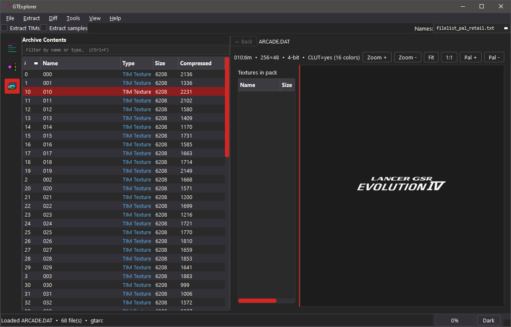
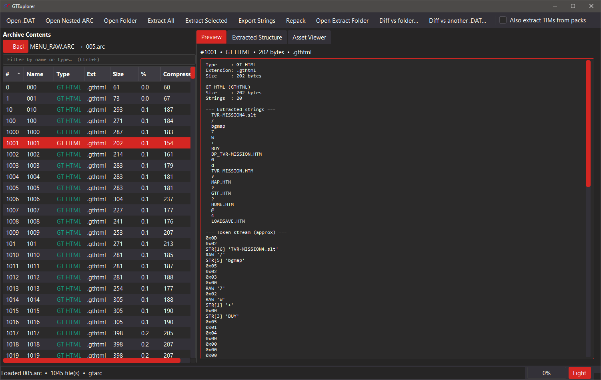
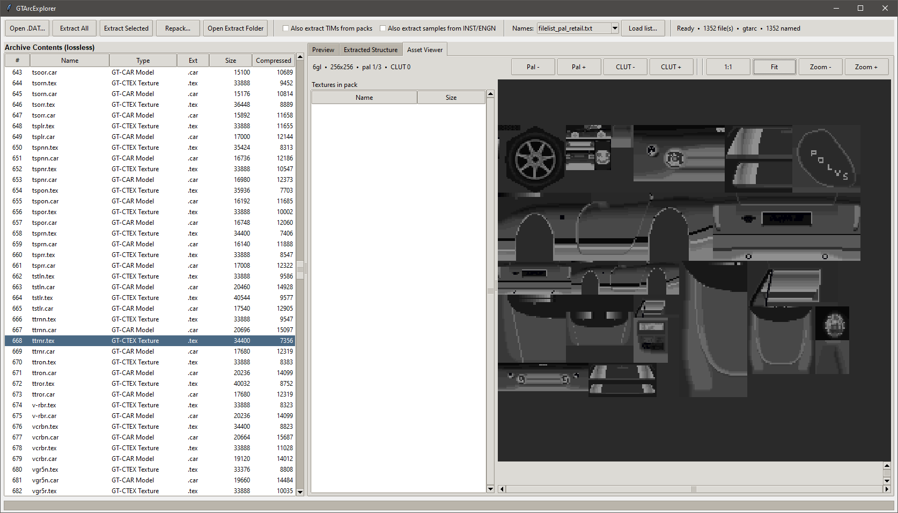

# GTExplorer

Extractor and viewer for **Gran Turismo 1** (PlayStation) archive files.





---

## Features

- Extract **GT-ARC** / **GT-ZIP** archives
- Optional **TIM pack** expansion and rebuild
- Optional **INST / ENGN** sample expansion
- Region **file lists** for real asset names on extract
- Built-in **Asset Viewer** (TIM, TIM packs, GT-CTEX, GT-PS)
- **Preview** for sequences, filename lists, GTHTML, and car part tables (SPEC, COLOR, …)
- Progress feedback while loading large archives

> **Note:** Repacking is currently unfinished.

---

## Requirements

- Python 3.8+
- [Pillow](https://python-pillow.org/) (for the Asset Viewer)
- PyQt6 ≥ 6.4

```bash
pip install -r requirements.txt
```

---

## Quick start

From the repo root:

```bash
python src/main.py
```

Windows:

```bash
runtool.bat
```

1. **Open…** — pick a `.DAT` / `.ARC`
2. (Optional) choose a **file list** so names are real instead of `000`, `001`, …
3. **Extract All** or **Extract Selected**

Full guide → [Usage](docs/usage.md)

---

## Archive kinds

| Kind | Detection | Examples |
|------|-----------|----------|
| Standard GT-ARC | `@(#)GT-ARC` | `COURSE.DAT`, `CAR.DAT`, `SOUND.DAT`, `MENU_RAW.ARC` |
| Compressed GT-ARC | Mangled `@(#)GT-A` / `RC` | `CARINF.DAT` |
| Raw GT-ZIP | No ARC wrapper | `GAMEFONT.DAT` |

---

## Detected types (summary)

| Content | Ext | Notes |
|---------|-----|--------|
| TIM texture | `.tim` | `10 00 00 00` magic |
| TIM pack | `.tpk` | Named TIM container |
| GT-PS / GT-CAR / GT-CTEX / GT-SKY | `.ps` / `.car` / `.tex` / `.sky` | Models & textures |
| Nested GT-ARC | `.arc` | Open with **Open Nested ARC** |
| GTHTML | `.gthtml` | GT menu/script data |
| INST / ENGN / SEQG | `.ins` / `.es` / `.seq` | Sound & sequences |
| SPEC, COLOR, TIRE, … | matching | Car part tables |
| Filename lists / text | `.idx` / `.txt` | Name tables & messages |

Full table + TIM pack layout → [Formats](docs/formats.md)

---

## File lists

Bundled region lists: `src/gtarcexplorer/filelists/`

Per-archive notes:

- [ARCADE.DAT](doc/filelists/ARCADE.DAT.MD)
- [BG.DAT](doc/filelists/BG.DAT.MD)
- [CAR.DAT](doc/filelists/CAR.DAT.MD)
- [CARCADE.DAT](doc/filelists/CARCADE.DAT.MD)
- [COURSE.DAT](doc/filelists/COURSE.DAT.MD)
- [GAMEMENU](doc/filelists/GAMEMENU.MD)
- [MENU_IMG](doc/filelists/MENU_IMG.MD)
- [MENU_RAW](doc/filelists/MENU_RAW.MD)
- [PITMENU.DAT](doc/filelists/PITMENU.DAT.MD)
- [REPLAY.DAT](doc/filelists/REPLAY.DAT.MD)
- [SOUND.DAT](doc/filelists/SOUND.DAT.MD)

---

## Known GT1 archives

See [Known archives](docs/archives.md).

---

## Project layout

```
src/
├── main.py
└── gtarcexplorer/
    ├── __init__.py
    ├── gui_qt.py
    ├── archive.py
    ├── detect.py
    ├── gtzip.py
    ├── filelist.py
    ├── filelists/
    │   ├── filelist_pal_retail.txt
    │   ├── filelist_usa_retail.txt
    │   ├── filelist_usa_demo.txt
    │   ├── filelist_jp_retail.txt
    │   ├── filelist_jp_demo.txt
    │   └── filelist_jp_testdrive.txt
    ├── tim_pack.py
    ├── tim_image.py
    ├── ctex.py
    ├── gtps.py
    ├── audio.py
    ├── spec.py
    ├── namelist.py
    ├── gthtml.py
    └── replay.py

thm/
├── icon.ico
└── dark.qss

runtool.bat
requirements.txt
docs/
```

---

## Notes

- Extract keeps **original bytes** (only GT-ZIP decompression when needed).
- Real names come from region file lists and, when present, embedded name lists.
- Asset Viewer needs Pillow; everything else works without it.

## Credits

- [pez2k / gt2tools](https://github.com/pez2k/gt2tools) — prior research into GT1 files
